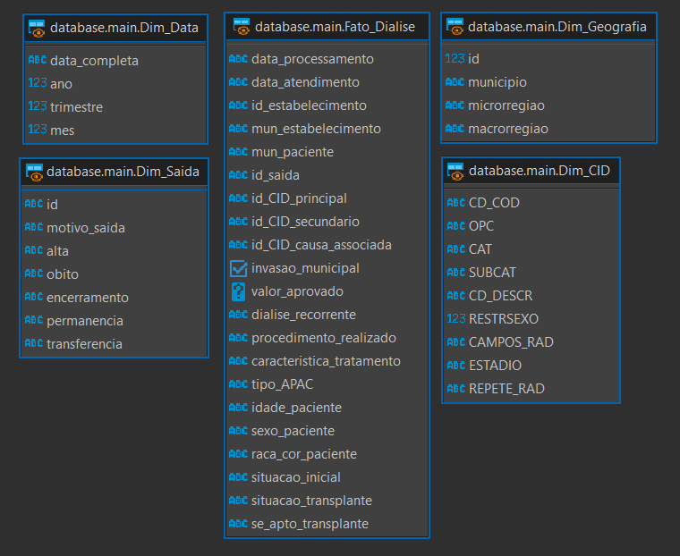

# 0. Introdução:
> Este projeto tem como objetivo principal a criação de um data warehouse e um cubo de dados para análise do tratamento dialítico no Rio Grande do Sul. Esses dados serão extraídos da base de dados pública do Datasus, a qual é mantida e disponibilizada pelo governo federal do Brasil e contém dados referentes a questões de saúde pública no Sistema Único de Saúde.

> Para contextualizar, um data warehouse é, em suma, uma estrutura centralizada de armazenamento de dados. Ela está relacionada ao conceito de Big Data, ou seja, é projetada para o uso em sistemas complexos onde haja uma grande vazão de dados variados.

> Além disso, um data warehouse geralmente está atrelado a alguns outros conceitos, como cubos de dados e ferramentas OLAP. A união dessas tecnologias possibilita a execução de análises mais completas sobre uma base de dados, envolvendo o uso de estruturas multidimensionais para representar, por exemplo, dimensões de tempo em diferentes granulariades.  

> Neste documento, descreveremos em detalhes a concepção, implementação e resultados deste projeto, destacando as etapas, metodologias e ferramentas utilizadas ao longo do processo. Por meio dessa análise, esperamos contribuir para o avanço do conhecimento e práticas relacionadas ao tratamento dialítico, bem como inspirar futuras iniciativas de análise de dados na área da saúde.

# 1. Concepção do projeto:

## 1.1 Concepção de um plano de projeto

> Para planejar a execução do projeto, optou-se por uma abordagem mais flexível e adaptativa. Uma análise preliminar revelou a extensão considerável e a complexidade do escopo do projeto, tornando-o desafiador para uma mensuração precisa.

> Logo, ao invés de ser feito um planejamento prévio completo para o projeto, a alternativa que foi encontrada para organizar o desenvolvimento foi a criação de um repositório Git central. Nesse repositório foi armazenado todo o progresso do projeto, o que ajudou a manter um controle temporal e espacial sobre o processo de desenvolvimento. 

> A utilização de um repositório central também se mostrou de grande utilidade na questão da estruturação do projeto, já que tornou obrigatória a busca por uma abordagem mais centrada à automação da coleta dos dados. Isto foi feito a fim de otimizar o uso de armazenamento no repositório, além de facilitar o manuseio das bases utilizadas.

## 1.2 Descrição do problema

> A partir dos dados representados pelo modelo lógico e que reflete o ambiente OLTP dos sistemas do DATASUS, pretende-se projetar um sistema OLAP para facilitar o processo de análise dos dados e geração de valor e dados facilmente usaveis por humanos.

> Com base nisso, o sistema deverá ser projetado em modelo de estrela ou floco-de-neve, bem como deverá ser capaz de performar consultas OLAP e operações de roll-up e drill-down sobre os dados da base selecionada.

## 1.3 Justificativa

> O uso de conceitos de ciência de dados em cenários que não sejam comerciais tem se mostrado muito eficaz ultimamente. Nesses casos, vale ressaltar as aplicações em que a implementação de sistemas de Big Data se sobressaem, como é o caso de cenários de análise de dados de saúde pública.

> Tendo isso em mente, o projeto englobará a implementação de um data warehouse simples para a base de dados de APAC de Tratamento Dialítico. Nesse contexto, também serão geradas algumas consultas OLAP que possam fornecer maior detalhe e precisão nos dados gerados, a fim de explicitar a utilidade de tal serviço para aprimorar políticas públicas, ou procedimentos, relacionadas à saúde renal.

> Isso se aplica muito bem levando em conta a região da cidade de Ijuí, a qual possui estabelecimentos de saúde que podem ser considerados de referência, tanto regional como estadual, em questão de tratamentos renais e de suas causas associadas.

## 1.4 Objetivos

> Este estudo de caso tem como objetivo principal desenvolver uma um sistema de data warehouse capaz de realizar consultas OLAP na base de dados de APAC de Tratamento Diaálitico. Junto a isso, ele também proporciona uma forma de reconhecimento e aprendizagem sobre os tópicos que envolvem a área sistemas distribuídos reais e em produção, e que possuam uma infraestrutura que pode ser considerada complexa, como é o caso do DataSUS.

> Como objetivo alternativo, optou-se pela experimentação a partir do uso de tecnologias alternativas e emergentes, as quais serão discutidades no próximo tópico, a fim de se expandir o conhecimento para além do que foi visto durante as aulas. Para isso, serão aplicados conceitos fundamentais do Big Data de uma maneira iterativa durante o desenvolvimento, de maneira que se possa identificar como ocorrerão as interações entre os diferentes componentes do sistema no seu funcionamento. 

## 1.4 Metodologia

> Como mencionado anteriormente, devido a algumas dificuldades encontradas durante a fase inicial do projeto, principalmente perante a questão da virtualização, bem como na interação com o SGBD DB2, mas também pelo interesse em testar abordagens novas, decidiu-se que grande parte do trabalho seria feito com o uso de tecnologias diferentes das apresentadas como modelo. 

> Portanto, como alternativas para as opções recomendadas inicialmente, foram escolhidas as seguintes tecnologias:
> - _Python_: para o processamento de dados e automação do processo de criação do banco de dados, visto que essa liguagem facilita o processo de prototipação através de scripts;
> - _Duck DB_: como banco de dados, por suas otimizações no que tange o gerenciamento de cubos de dados e a execução de instruções _OLAP_;
> - _Pandas_: como biblioteca para a organização de dados e para a geração de relatórios;
> - _DBeaver_: como ferramenta para o gerenciamento e a visualização do banco de dados, bem como para a organização do modelo estrela multidimensional.

# 2. Implementação do Plano de Projeto proposto – critérios técnicos

## 2.1 Povoar o DW com dados

> Para criação de um Data Warehouse com os dados desejados, desenvolvemos acabamos automatizando o processo de ETL em três etapas:
> 1. **Script susgrep.sh**: Este arquivo se encarrega de baixar todos os dados necessários da base de dados do SUS via protocolo FTP, e após faz a chamada de **cnv2csv** para cada arquivo CNV baixado da base, assim fazendo um primeiro tratamento dos dados
> 2. **Script cnv2csv.py**: Este script se encarrega de converter arquivos do formato CNV, um formato próprio do DataSUS desenvolvido para descrição de tabelas, e os converte para tabelas CSV.
> 3. **Script convert_dbf_to_db.py**: Este ultimo script se encarrega de ler todos os arquivos DBF e CSV baixados/criados nas etapas anteriores e cria um arquivo de banco de dados DuckDB com tabelas geradas a partir dos arquivos consumidos. 

## 2.2 Modelo Dimensional

> A partir do DataWarehouse criado, pudemos verificar tabelas de interesse relacionadas ao tema deste trabalho, tratamentos dialíticos neste caso.
> O primeiro destaque que fizemos foi a tabela ATDRS que justamente registra as operações de diálise realizadas pelo rio grande do sul. Dentro desta tabela categorizamos alguns dados relevantes para um modelo dimensional:
> - Valor aprovado da diálise
> - Os tipos de saída durante o tratamento
> - Ocorrência de invasão municipal
> - Se o tratamento é recorrente
> - Datas de atendimento e processamento
> - Estabelecimento que ocorreu a diálise
> - Procedimento realizado
> - Tipo de autorizaç;ao de procedimento ambulatorial
> - Município do estabelecimento
> - Idade do paciente
> - Sexo do paciente
> - Raça do paciente
> - Município do paciente
> - Motivo de saída
> - CID principal, secundária e de causa associada
> - O caráter do tratamento
> - Situação inicial do paciente
> - Situação para transplante do paciente e instruções caso apto

> A partir das informações levantadas, criamos um modelo dimensional que analisa as operações de diálise (fato) a partir das datas de tratamento e processamento, sua localização geográfica dentro do estado, sua saída e por CIDs relacionadas ao tratamento.
> Para criação desse modelo, foi criado um script **OLAP_schema.sql** que cria Views para cada fato e dimensão, tirando a necessidade de reestruturar os dados e tratá-los novamente. 

*Diagrama ER do modelo dimensional a partir de views do banco de dados gerado*


## 2.3 Um exemplo de Dimensão com Hierarquia

> Das dimensões criadas para o cubo de dados deste projeto, duas delas possuem hierarquia:
> - **Dim_Data**: Ano $\rightarrow$ Trimestre $\rightarrow$ Mês
> - **Dim_Geografia**: Macro-região $\rightarrow$ Micro-região $\rightarrow$ município 

## 2.4 Granularidade do DW (nível de detalhamento)

> A granularidade do modelo dimensional criado pode ser definida pelo nível mais detalhado de dados que está sendo armazenado. No caso, a granularidade deste cubo de dados está no nível de um atendimento de diálise específico. Isso significa que cada registro na tabela de fatos representa um único evento de diálise, com atributos associados como data de atendimento, estabelecimento, município, características do tratamento, entre outros.

## 2.5 Exemplificação de operações DRILL DOWN/ROLL UP

### Drill Down:
> Drill Down é o processo de descer para um nível mais detalhado na hierarquia dos dados. Vamos considerar a dimensão de tempo (Dim_Data) para o exemplo:
> 1. **Nível Superior (Ano)**: Suponha que estamos analisando os valores aprovados (*Fato_Dialise.valor_aprovado*) para diálises no ano de 2022.
>       ```SQL
>            SELECT SUM(fd.valor_aprovado) 
>            FROM main.Fato_Dialise fd
>            LEFT JOIN main.Dim_Data dd
>                ON fd.data_processamento = dd.data_completa
>            WHERE dd.ano = 2022;
>       ```
>       - Total de Valor Aprovado em 2022: R$ 202.623.392,05
> 2. **Drill Down para Nível Inferior (Trimestre)**: Queremos ver a distribuição desse valor por trimestre.
>       ```SQL
>            SELECT dd.trimestre, SUM(fd.valor_aprovado) 
>            FROM main.Fato_Dialise fd
>            LEFT JOIN main.Dim_Data dd
>                ON fd.data_processamento = dd.data_completa
>            WHERE dd.ano = 2022
>            GROUP BY dd.trimestre;
>       ```
>       - 1º Trimestre de 2022: R$ 49.460.060,46
>       - 2º Trimestre de 2022: R$ 50.949.117,90
>       - 3º Trimestre de 2022: R$ 51.522.749,18
>       - 4º Trimestre de 2022: R$ 50.691.464,51
> 3. **Drill Down para Nível Inferior (Mês)**: Desejamos detalhar o valor aprovado no 2º trimestre por mês.
>       ```SQL
>            SELECT dd.mes, SUM(fd.valor_aprovado)
>            FROM main.Fato_Dialise fd
>            LEFT JOIN main.Dim_Data dd
>                ON fd.data_processamento = dd.data_completa
>            WHERE dd.ano = 2022 AND dd.trimestre = 2
>            GROUP BY dd.mes;
>       ```
>      - Abril de 2023: R$ 16.819.213,47
>      - Maio de 2023: R$ 17.063.688,62
>      - Junho de 2023: R$ 16.808.562,42

#### Roll Up:
> Roll Up é o processo de agregar dados para um nível mais alto na hierarquia.
> 1. **Nível Inferior (Mês)**: Começamos com os valores aprovados por mês no 2º trimestre de 2023.
>    - Abril de 2023: R$ 16.819.213,47
>    - Maio de 2023: R$ 17.063.688,62
>    - Junho de 2023: R$ 16.808.562,42
> 
> 2. **Roll Up para Nível Superior (Trimestre)**: Agregamos os valores mensais para obter o total do trimestre.
>    - 2º Trimestre de 2023: R$ 50.949.117,90
> 
> 3. **Roll Up para Nível Superior (Ano)**: Finalmente, somamos os valores dos trimestres para obter o total anual.
>    - Total de Valor Aprovado em 2023: R$ 202.623.392,05

## 2.6 Exemplificação de um CUBO DE DADOS (com dados)

## 2.7 Exemplificação da geração de relatórios usando o Excel (ou outra ferramenta) como ferramenta OLAP