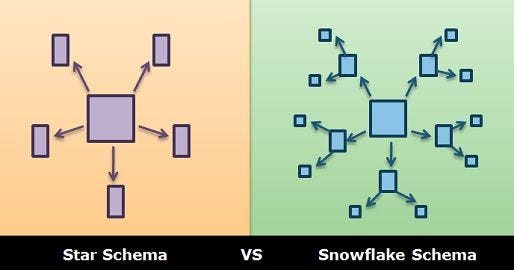
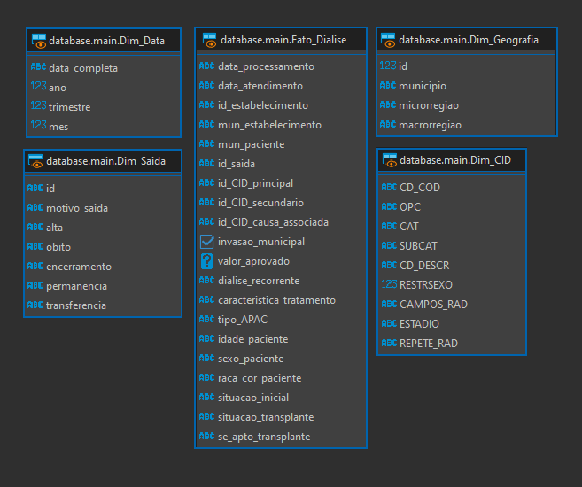
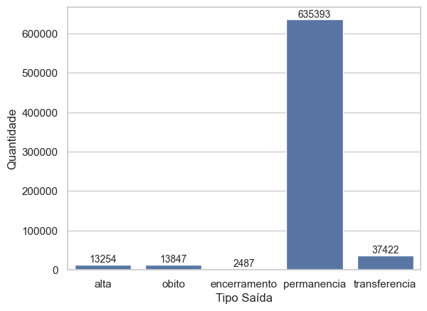
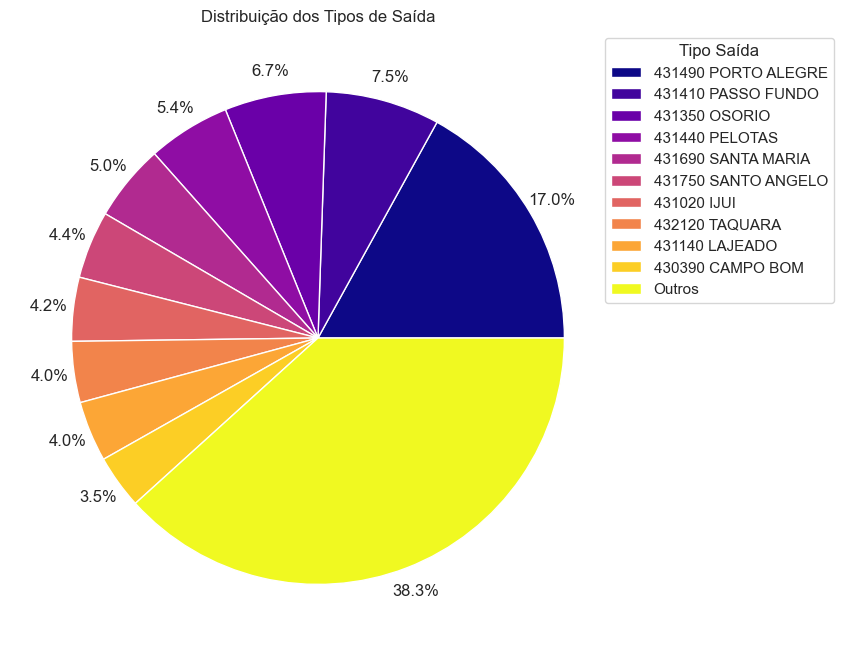

<!-- theme: uncover   -->
<!-- class: invert -->

### Projeto de DW – Estudo de Caso DATASUS

###### Gustavo Campos, Bruno Moretto, Gabriel Buron, Juan Fricke

---

# Processos de negócios do DATASUS...


---

# Concepção de um plano de projeto

* Uma análise preliminar revelou a extensão considerável e a complexidade do escopo do projeto

* repositório Git central
*controle temporal e espacial sobre o processo de desenvolvimento.*

---

# Vantagens de um repositorio git centralizado

* controle temporal e espacial sobre o processo de desenvolvimento.

* estruturação do projeto

* centrada à automação da coleta dos dados

* facilitar o manuseio das bases utilizadas

---

# Descrição do problema

A partir dos dados representados pelo modelo lógico e que reflete o ambiente OLTP dos sistemas do DATASUS, pretende-se projetar um sistema OLAP para facilitar o processo de análise dos dados e geração de insights.


---



Com base nisso, o sistema deverá ser projetado em modelo de estrela ou floco-de-neve, bem como deverá ser capaz de performar consultas OLAP e operações de roll-up e drill-down sobre os dados da base selecionada.

---

# Justificativa

* Ijuí possui hospitais que podem ser considerados de referência em tratamentos renais.

* análise de dados de saúde pública utilizando conceitos de computação pode ser valioso para a comunidade.

* explicitar a utilidade de tal serviço pode aprimorar políticas públicas, ou procedimentos, relacionadas à saúde renal.

---


# Objetivos:

  Desenvolver um data warehouse para realizar consultas OLAP na base de dados de APAC de Tratamento Dialítico do DataSUS.

- Experimentar tecnologias alternativas e emergentes:
- Expandir conhecimento além do conteúdo das aulas.
- Aplicar conceitos fundamentais de Big Data de forma iterativa.
- Identificar interações entre os componentes do sistema.

---

# Metodologia

- _Python_:  Usado para ETL
- _Duck DB_: Usado como DW
- _DBeaver_: SGBD como interface


  

---

# Base de Dados

 
- APAC de Tratamentos Dialíticos;
- Dados do Rio Grande do Sul.

---

# Modelo Dimensional (Cubo de Dados)

- Análise a partir do registros das diálises
- Dimensões criadas a partir de tabelas secundárias
- Utilização de Views

---



---

# Dimensões com Hierarquia

**Data**: Ano $\rightarrow$ Trimestre $\rightarrow$ Mês
**Geografia**: Macro-região $\rightarrow$ Micro-região $\rightarrow$ município 

---

# Granularidade do DW

Cada registro na tabela de fatos representa um único evento de diálise, com atributos associados como data de atendimento, estabelecimento, município, características do tratamento, entre outros.

---

# DRILL DOWN/ROLL UP

---

1. **Nível Superior (Ano)**: Suponha que estamos analisando os valores aprovados para diálises no ano de 2022.
```SQL
SELECT SUM(fd.valor_aprovado) 
FROM main.Fato_Dialise fd
LEFT JOIN main.Dim_Data dd
    ON fd.data_processamento = dd.data_completa
WHERE dd.ano = 2022;
```
> Total de Valor Aprovado em 2022: R$ 202.623.392,05

---

 2. **Drill Down para Nível Inferior (Trimestre)**: Queremos ver a distribuição desse valor por trimestre.
```SQL
  SELECT dd.trimestre, SUM(fd.valor_aprovado) 
  FROM main.Fato_Dialise fd
  LEFT JOIN main.Dim_Data dd
      ON fd.data_processamento = dd.data_completa
  WHERE dd.ano = 2022
  GROUP BY dd.trimestre;
```
> 1º Trimestre de 2022: R$ 49.460.060,46
> 2º Trimestre de 2022: R$ 50.949.117,90
> 3º Trimestre de 2022: R$ 51.522.749,18
> 4º Trimestre de 2022: R$ 50.691.464,51

---

3. **Drill Down para Nível Inferior (Mês)**: Desejamos detalhar o valor aprovado no 2º trimestre por mês.
```SQL
SELECT dd.mes, SUM(fd.valor_aprovado)
FROM main.Fato_Dialise fd
LEFT JOIN main.Dim_Data dd
ON fd.data_processamento = dd.data_completa
WHERE dd.ano = 2022 AND dd.trimestre = 2
GROUP BY dd.mes;
```
> Abril de 2023: R$ 16.819.213,47
> Maio de 2023: R$ 17.063.688,62
> Junho de 2023: R$ 16.808.562,42

---

# Geração de Relatórios

---

# Ferramentas

  


---



---



---

# Obrigado!