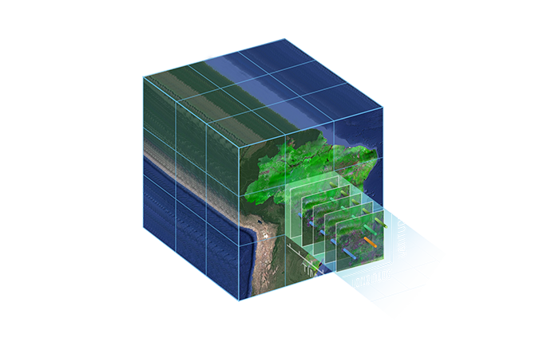
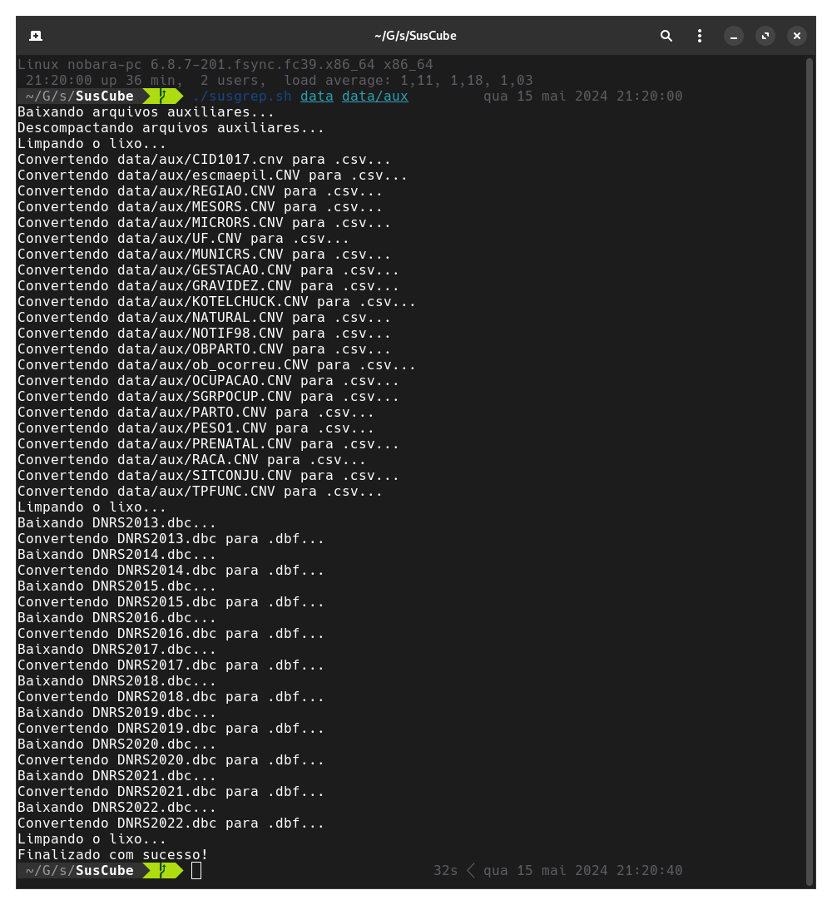
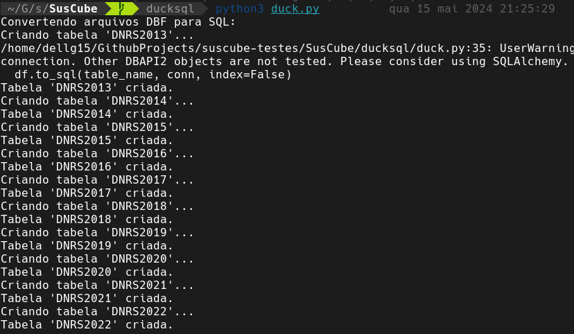

<!-- theme: uncover   -->
<!-- class: invert -->

### Projeto de DW – Estudo de Caso DATASUS

###### Gustavo Campos, Bruno Moretto, Gabriel Buron, Juan Fricke

---

# Processos de negócios do DATASUS...

---

# Concepção de um plano de projeto

---

# Descrição do problema

---

# Descrição do problema

---

# Objetivos

---

# Metodologia

---

# Modelo Dimensional

---

# Um exemplo de Dimensão com Hierarquia

---

# Granularidade do DW (nível de detalhamento)

---

# Exemplificação de operações DRILL DOWN/ROLL UP

---

# Exemplificação de um CUBO DE DADOS (com dados)

--- 

# Exemplificação da geração de relatórios usando ferramenta OLAP

---

---

---